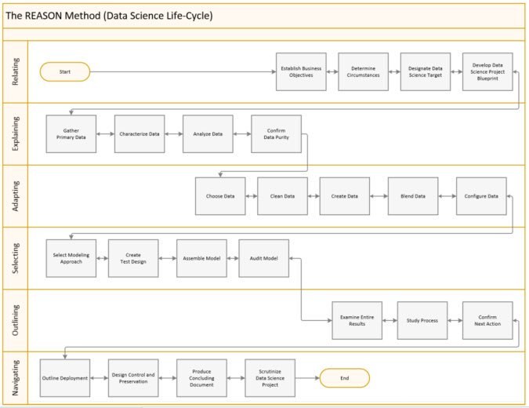

```{r setup, include=FALSE}
knitr::opts_chunk$set(echo = TRUE)
```


## Why it matters

When working with recurring clients and projects together with tight deadlines it is easy to cut corners or forget good practice.

Here are the top reasons why a data science workflow is vital:  

- Work is well documented  
- Folders and files logically are structured  
- Projects remain version controlled  
- Data output is tracked  
- Logical seperation of scripts make productizing easy  
- Good naming conventions make tracking of the project flow easy  
- Returning to the same methodology is met with less panic  
- Changing the project structure becomes more difficult the longer you wait


### Projects structure

Your project should have at least 2 main housing folders;  

- A git repository for maintaining code  
- A local folder on a shared drive containing data and outputs  

#### Git repository

The git repository is essential for effective collaboration, tracking and version control.

The git repository will usually comprise of the following folders;  

`static` 

A folder for keeping sub folders for images/references/material used in markdowns and client rendered documents

***

`R/Py_scripts`

- Each script should contain a number/letter (or both) prefix to indicate a logical order of execution  
- Similar to code normalization it is important that each script should achieve a very specific task. If a script achieves more than one result we should consider splitting the script up  
- Functions should be sourced from an appropriately named script  

***

`about`  

This folder should contain flowcharts, package versions and a description of what the code does.  

#### Local folder

Should contain folders for;  

`plot_output`  

All plots generated by scripts should be saved to appropriate sub folders in here.  

***

`presentations`  

All client presentation versions should be stored here

***

`data`  

- raw_data - all data recieved directly from the client  
- molded_data - all data that we have engineered in some way to some purpose  

***

`objects`  

Code execution will often require some time. For this reason and for reproducibility it is important that intermediate results be saved. Save all intermediate objects used in scripts here.

## Workflow



## Special mention

### Use Rmd or Notebook

When writing code use Rmd or jupyter notebooks to generate well documented code. 

- This ensures that future you can understand how the code works when the client or project returns unexpectedly.  
- We can use these documents to inspect output that was tasked to run unsupervised  
- We can use .md files to populate client decks or blogposts  

***

### Track assumptions clearly

It is of upmost importance to track assumptions!  

It is very easy to get side tracked while doing exploratory work. One must balance the reward of exploration with the time available to exploit viable angles of attack. This is why we need to keep track of the questions we are trying to answer and the story we are currently telling. Without stepping back frequently the project can get derailed.  

- Client outcomes  
- Desired output  
- SQL filters applied to the data  
- Assumptions made/implied by chosen models  
- Assumptions of engineered calculations and generated data columns  

***

### Save all intermediate results

Whenever you complete a key step of your solution save the objects to the `objects` folder on your local mapped drive  

***

### Keep all intermediary results tidy

Always store and work with tidy inputs, even if it would be easier not to do so. For example if producing a MFA output dataframe or sampled dataframe make sure that the dataframe can be easily joined via a key and that the data is in a normalised form.

Ignore this warning at your own peril; there is nothing worse than coming back to an object and realizing you no longer have the origin data and you can't join using index or other method.  

***

### Your code should be loud and transparent

Any assumptions made, operations made, checks done should be output somewhere. Every time your code produces a result that result needs to be displayed! If you have done a clustering, prove it, show it, display model parameters!  

***

### When possible output should be propperly knit/saved

This helps keep track of what you've done and lets others see your progress while enabling them to validate/peer review your work without having to understand every line of code.  

***

### Keep It Simple Stupid

Although code should use functional/object oriented approaches as applicable the code should never become more complicated than truly required.

***

### Reproducibility

The code should be;  
- Version controlled via git or otherwise  
- Version controlled via checkpoint, packrat or py virtual environment  
- Software/setup version summary should be recorded  
- Seeds should be set when the analytics requires stochastic models such as non negative matrix factorization  

***

### Data workflow

- before using any data summarise the data;  
	- number of records  
	- sum of numeric columns
	- etc.  


